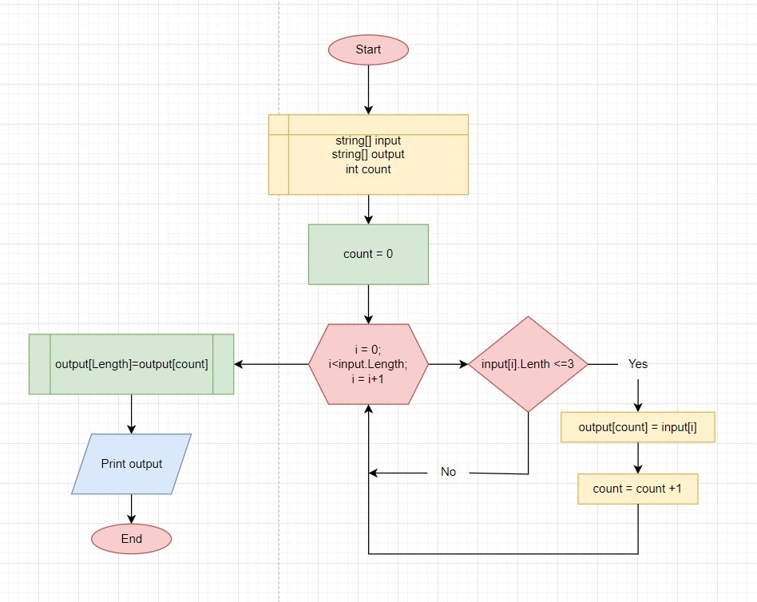

# Описание решения задачи:

>Написать программу, которая из имеющегося массива строк формирует массив из строк,
длина которых меньше либо равна 3 символа. Первоначальный массив можно ввести с клавиатуры,
либо задать на старте выполнения алгоритма.

>>Например:

>>["hello", "2", "world", ":-)"] -> ["2", ":-)"] 

>>["1234", "1567", "-2", "computer science"] -> ["-2"]

>>["Russia", "Denmark", "Kazan"] -> []

1. Создаем массив ***input***, при помощи ввода текста в консоль. Для этого просим пользователя ввести любые символы, разделяя пробелом. Элементы массива разделяются проделом, таким образом програмно определяется размер массива ***input***.
* Можно рассмотреть решение задачи путем заполнения массива ***input*** на старте выполнения алгоритма: Для этого создаем строковый массив ***input***, указав длину маcсива и значения его элементов, разделив эти элементы знаком " , ".
 
2. Создаем второй массив ***output***, в котором присваиваем размер массива ***input***.

3. Создаем переменную ***count***, которой присваиваем значение 0. Эта переменная ***count*** будет использована как счетчик индексов массива ***output***.

4. Запускаем цикл ***for***, который проходит по элементам массива ***input***, и определяет, кикие элементы массива имеют не более 3 символов. Если условие верно: перемення ***count*** увеличивается на единицу, а значение индекса записывается в массив ***output***. В противном случае: переходим к следующему элементу массива ***input***. После прохода по всем элементам массива ***input*** - выходим из цикла.

5. При помощи метода ***Array.Resize*** убираем пустые элементы массива ***output***.

6. Выводим получившийся результат в консоль.

7. Завершаем работу программы нажатием любой клавиши.

Решение задачи можно представить в виде блок-схемы:

